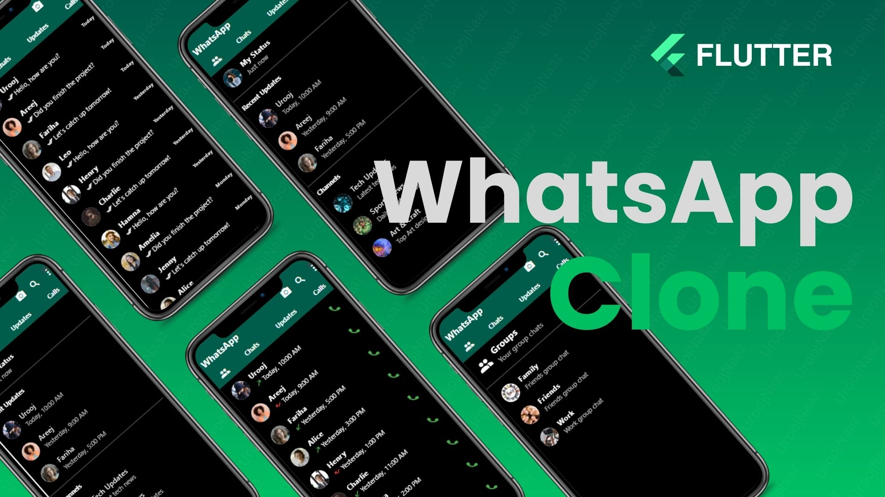

# WhatsApp Clone - Flutter Chat Application
Welcome to the GitHub repository for the WhatsApp Clone app, a feature-rich chat application built using Flutter. This app mimics the functionality and design of WhatsApp, providing an intuitive user interface for messaging, group chats, status updates, and calls.

Star⭐ the repo if you like what you see😉.

## 📸 ScreenShots

## Features
* **Tabbed Navigation:** Seamlessly switch between Groups, Chats, Updates, and Calls using a custom AppBar and bottom navigation tabs.

* **Group Chat:** Engage in group conversations with multiple group support.

* **Individual Chats:** Interact with contacts through a dynamic chat list showing the latest messages and timestamps.

* **Status Updates:** Share and view text and image status updates from your contacts.

* **Call Logs:** Monitor incoming, outgoing, and missed calls with comprehensive call logs.

* **Custom Drawer Menu:** Quickly access Profile, Settings, and Logout via a custom side drawer menu.
Theming: Enjoy a consistent user experience with WhatsApp-themed colors.

* **Profile Avatars:** Easily identify users with profile pictures in group chats, individual chats, status updates, and call logs.

* **Responsive UI:** Experience an adaptable layout across various screen sizes and orientations.

## ✨ Requirements
* Any Operating System (ie. Android, IOS, MacOS X, Linux, Windows)
* Any IDE with Flutter SDK installed (ie. IntelliJ, Android Studio, VSCode etc)
* A little knowledge of Dart and Flutter
* A brain to think 🤓🤓

## Getting Started

This project is a starting point for a Flutter application.

A few resources to get you started if this is your first Flutter project:

- [Lab: Write your first Flutter app](https://docs.flutter.dev/get-started/codelab)
- [Cookbook: Useful Flutter samples](https://docs.flutter.dev/cookbook)

For help getting started with Flutter development, view the
[online documentation](https://docs.flutter.dev/), which offers tutorials,
samples, guidance on mobile development, and a full API reference.

## Happy coding! 🌟

If you have any questions or need further assistance, feel free to reach out.
